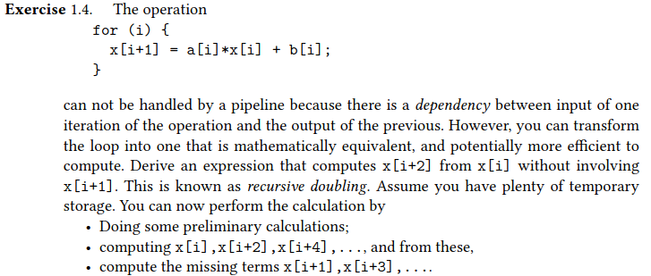

# HPC notes

## The Multithreaded DAG Model

`Directed Acyclic Graph (DAG)` : a collection of vertices and directed edges (lines with arrows). Each edge connects two vertices. The final result of these connections is that there is no way to start at some vertex ‘A’, follow a sequence of vertices along directed paths, and end up back at ‘A’.

Each vertex is an operation like a function call, addition, branch, etc.
Directed edges show how operations depend on one another.

### **Work and Span**

 **Work**
> W(n) : number of vertices in the DAG.

**Span** 
> D(n) : number of vertices on the longest pasth through the DAG. Span is also known as the *critical path*.

The following equations hold true regarding the execution time for a task described by a DAG,

$$T_1(n) = W(n)$$
$$T_\infty (n) = D(n)$$

### Basic Work Span Laws

The average available parallelism in the DAG can be expressed as the amount of work per critical vertex

$$ \frac{W(n)}{D(n)} $$

This fractions denotes how many processors can be usefull for the problem.

#### Span Law

$$ T_p(n) \ge D(n) $$

#### Work Law

$$ T_p(n) \ge \frac{W(n)}{P} $$

so 

$$ T_p(n) \ge max{ \frac{W(n)}{P}, D(n) } $$

### Brent's Theorem

> The upper limit of time to execute a path using P processors is less or equal to the time to execute the critical path + the time to execute everything off the critical path using p processors.

$$ T_p(n) \le \frac{W(n)-D(n)}{P} + D(n) $$

This sets the goal for any scheduler!

$$ max{( \frac{W(n)}{P}, D(n) )} \le T_p(n) \le \frac{W(n)-D(n)}{P} + D(n) $$

These two limits are within a factor of 2 with each other!

This implies that you may be able to execute the DAG in a faster time than Brent predicts, but never faster than the lower bound.

### Scaling and Optimality

Speedup is defined as the ratio between best sequential time and parallel time.

$$ S_p(n) = \frac{T_.(n)}{T_p(n)} $$

The ideal speedup is linear with the number of processors.

To achieve linear scaling we need:

1. Work optimality
2. Weak scaling

#### **Work optimality**

> The work of the parallel algorithm should match the best sequential algorithm.

#### **Weak scalability**

> Work per processor has to grow proportional to the span which depends on problem size N.

#### **Strong scaling**

> The number of processors is increased while the problem size remains constant. This also results in a reduced workload per processor. The individual workload must be kept high enough to keep all processors fully occupied. Ideally, the program would speed up by a factor of N when it runs on a machine having N nodes. It is used in *CPU-bound* applications.

#### **Weak scaling**

> Both the number of processors and the problem size are increased. This also results in a constant workload per processor. We are solving larger problems in the same time as it takes to solve smaller ones on a smaller machine. It is used in *memory-bound* applications.

## Computer Architecture

### Instruction-level Parallelism (ILP)

A family of processor and compiler design techniques that speed up execution by causing individual machine operations, such as memory loads and stores,
integer additions and floating point multiplications, to execute in parallel.

Micro-architectural techniques that are used to exploit ILP include:

* multiple-issue: instructions that are independent can be started at the same time
* pipelining: arithmetic units can deal with multiple operations in various stages of completion
* branch prediction and speculative execution: a compiler can ‘guess’ whether a conditional instruction will evaluate to true, and execute those instructions accordingly
* out-of-order execution: instructions can be rearranged if they are not dependent on each other,
and if the resulting execution will be more efficient;
* prefetching: data can be speculatively requested before any instruction needing it is actually encountered.

## Recursive doubling

## Pipelining

If every pipeline stage is designed to finish in 1 clock cycle, each FPU can produce one result per cycle asymptotically.

The first result cannot be computed in less cycles than the number of stages, the later can!